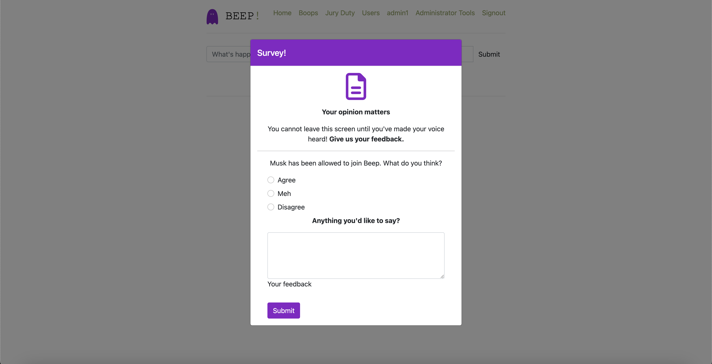
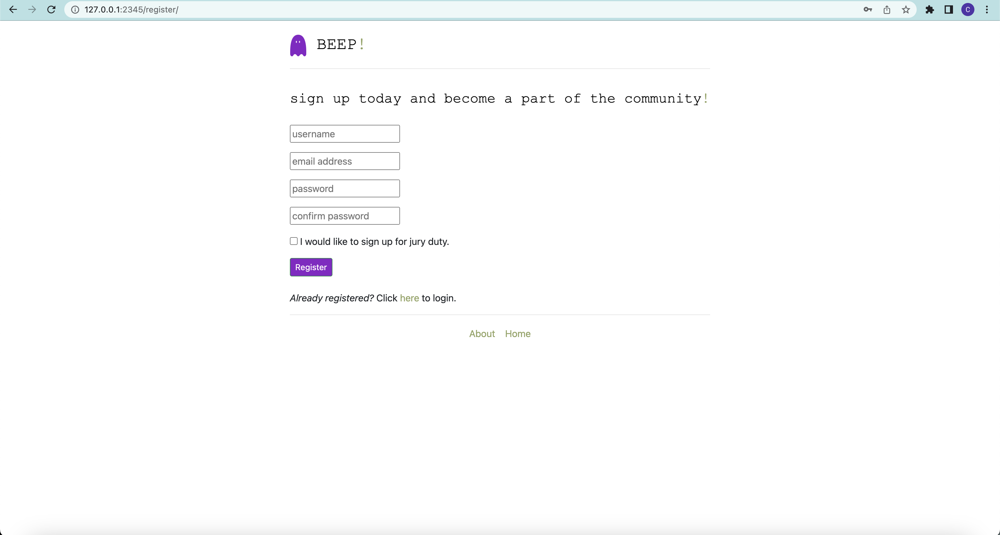

# Beep
CPSC 611: Final Project Implementation

## What is Beep?
Beep is a democratic social media platform aimed at creating more transparency for the policy decisions of socoial media platforms. This transparency is created through implementation of the following features:
01. An upvote/downvote system incorporated into policy changelogs after major version updates, such that users can express their views on policy changes. The platform can then use this data to inform future iterations of the policy. 
02. Unskippable surveys to measure user views on select controversial policy issues. Results from these surveys can guide or determine content policy. 
03. Mandatory “jury duty” for select users to deliberate on controversial policy issues. 

## How to Run Beep
In order to see how Beep works yourself, simply clone the repository to your local machine. Then, navigate to the repository directory within your terminal and enter 'python3 run.py'.  Then, use one of the suggested addresses (for example, http://127.0.0.1:2345) to navigate to the site using your preferred search engine. From there, you will be able to create an account, post Beeps, follow accounts, and participate in the democratic features of the platform.

## Feature Screenshots

### Mandatory Surveys

### Jury Duty

#### Administrator View: Create Jury Issue

#### User View: Blank Jury Discussion

#### User View: Comment Posted

#### User View: Reply Posted

#### User View: Jury Voting

#### User View: Vote Submitted 

#### Administrator View: View Vote Results

#### Administrator Discussion View

### Changelog Voting

### User Registration

### Home Page

## Tech Stack
The following were used in the creation of Beep: Python, Flask, SQLAlchemy, HTML, CSS, Bootstrap, JavaScript, and Jinja.

## References
Twitter Clone Reference: https://code-projects.org/simple-twitter-clone-in-python-using-flask-with-source-code/
